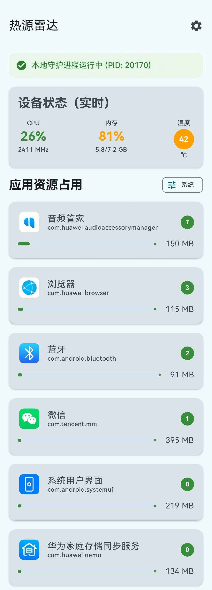
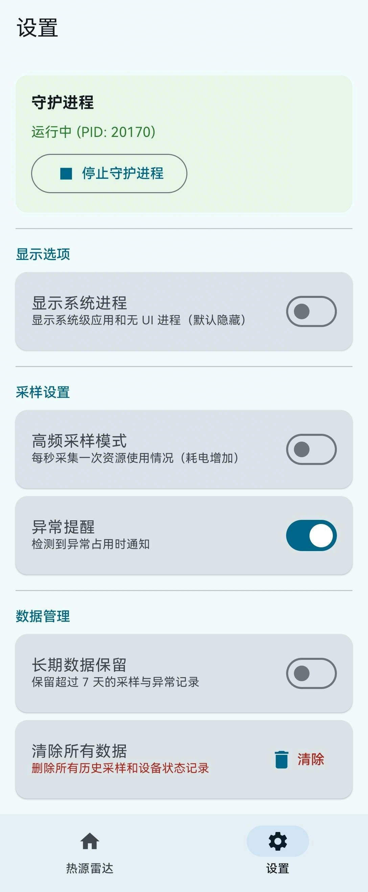

# 热源雷达 (HeatRadar)

一款面向 Android 设备的**实时资源监控工具**，帮助你快速定位手机发热、卡顿、耗电异常的元凶应用。

**当前版本：v1.1.0**

## ✨ 功能特性

### 核心监控
- **实时 CPU/内存排行**：实时展示各应用的 CPU 占用和物理内存占用 (RSS)
- **设备状态概览**：CPU 使用率、CPU 频率、内存占用、电池温度
- **多进程聚合**：同一包名的多进程（如 `:push`、`:appbrand`）自动聚合为一个条目
- **系统进程过滤**：默认隐藏低资源占用的系统进程，可一键切换显示
- **应用详情**：单个应用的 CPU、内存、活跃时长等详细信息

### v1.1.0 新增功能
- **悬浮窗监控**：可拖拽的悬浮监控面板，支持自动吸附屏幕左右边缘，一键最小化为迷你悬浮球（44dp），不遮挡操作
- **FPS 实时监测**：通过 Shizuku 读取 SurfaceFlinger 数据，显示实时刷新率
- **功耗/电池监控**：实时电流(mA)、电压(V)、功耗(mW)、电量、充电状态
- **网络速度监控**：实时下行/上行速率，自动 B/s → KB/s → MB/s 单位换算
- **智能告警系统**：CPU/内存/温度/功耗超阈值自动告警，悬浮窗边框变色 + 系统通知
- **GPU 监控**：GPU 使用率、GPU 频率（支持部分设备）
- **可展开详情面板**：主 Tab 设备状态卡片展开后显示 CPU 核心频率柱状图、所有传感器温度、GPU 详情、功耗详情、网络速度
- **Top3 高占用应用**：悬浮窗快速 glance 排名前三的 CPU 占用应用
- **迷你趋势线**：悬浮窗每个指标显示最近 30 个采样点的迷你 sparkline 趋势图

### 其他特性
- **异常提醒**：自动识别高资源占用应用并给出提示
- **设置持久化**：所有偏好设置通过 DataStore 持久化，重启不丢失
- **多数据源支持**：轻量级守护进程（推荐）/ Shizuku / UsageStats 自动降级

## 📸 截图

<div style="display: flex; gap: 16px; flex-wrap: wrap;">
  
  
  
</div>

- **主页（热源雷达）**：实时设备状态 + Top10 应用资源占用排行，点击展开查看详细诊断面板
- **设置页**：守护进程控制、显示选项、采样设置、数据管理、悬浮窗开关、ADB 增强模式
- **悬浮窗**：展开模式显示核心指标+Top3应用，收起为44dp迷你球显示CPU百分比，边缘自动吸附

## 📱 系统要求

- **最低版本**：Android 10 (API 29)
- **目标版本**：Android 15 (API 35)
- **架构**：Kotlin + Jetpack Compose + MVVM

## 🔧 获取真实数据的方式

由于 Android 系统的沙箱限制，普通应用无法直接读取其他进程的 CPU 和内存数据。HeatRadar 支持三种数据源，按优先级自动选择：

### 1. 轻量级守护进程（推荐，无需安装额外应用）

通过一条 ADB 命令启动内置的 shell 守护进程（daemon），daemon 以 shell 权限在后台持续运行（每 2 秒采集一次），将所有系统数据写入 App 可读取的文件。无需安装 Shizuku 等第三方应用。

**采集内容**：
- 进程级 CPU% / RSS 内存（通过 `top`）
- 总 CPU 使用率（通过 `/proc/stat`）
- CPU 频率（通过 `/sys/devices/system/cpu/cpu*/cpufreq/`）
- 温度传感器（通过 `/sys/class/thermal/`）
- 内存信息（通过 `/proc/meminfo`）
- GPU 信息（通过 `/sys/kernel/gpu/`）
- 功耗/电池（通过 `/sys/class/power_supply/battery/`）
- 网络流量（通过 `/proc/net/dev`）

**使用步骤：**

1. 安装并打开 HeatRadar
2. 首页会显示"启动数据采集服务"引导卡片
3. 点击卡片上的**复制命令**按钮，复制 ADB 启动命令
4. 手机通过 USB 连接电脑，在终端中粘贴并执行复制的命令（仅需执行一次）
5. 返回 App，会自动检测到 daemon 运行，随即开始展示所有应用的真实数据

**启动命令示例：**

```bash
adb shell "sh -c 'cp /sdcard/Android/data/com.example.heatradar/files/heat_daemon.sh /data/local/tmp/heat_daemon.sh 2>/dev/null; chmod 755 /data/local/tmp/heat_daemon.sh 2>/dev/null; nohup sh /data/local/tmp/heat_daemon.sh >/dev/null 2>&1 &'"
```

**停止 daemon：**

在 App 设置页可以停止 daemon，或执行以下 ADB 命令：

```bash
adb shell "sh -c 'PID=$(cat /sdcard/Android/data/com.example.heatradar/files/daemon.pid 2>/dev/null); if [ -n "$PID" ]; then kill $PID 2>/dev/null; fi; pkill -f heat_daemon.sh 2>/dev/null; rm -f /sdcard/Android/data/com.example.heatradar/files/heat_daemon.sh /sdcard/Android/data/com.example.heatradar/files/daemon.pid /data/local/tmp/heat_daemon.sh 2>/dev/null; echo done'"
```

**注意事项：**
- 设备重启后 daemon 会停止，需重新执行一次 ADB 命令
- daemon 资源占用极低（shell 脚本 + 每 2 秒一次采样），自身 CPU 占用 <1%，几乎不影响续航
- 如果 daemon 异常退出，App 会自动降级到其他数据源
- **更新版本后需重新部署 daemon**（旧版 daemon 会因脚本不匹配导致数据异常）

### 2. Shizuku（备选方案）

Shizuku 允许应用以 ADB/shell 权限直接执行系统命令，无需后台进程。适合不愿使用 ADB 命令但愿意安装 Shizuku 应用的用户。**FPS 监测功能需要 Shizuku。**

**安装步骤：**

1. 下载安装 [Shizuku](https://github.com/RikkaApps/Shizuku/releases)（也可在酷安搜索"Shizuku"）
2. 启动 Shizuku 服务（以下方式任选其一）：
   - **无线调试（Android 11+，推荐）**：开发者选项 → 开启"无线调试" → Shizuku 应用中点击"启动" → 按提示配对
   - **USB 连接电脑**：执行以下命令
     ```bash
     # 启动 Shizuku 服务（路径可能因设备和版本不同，以 Shizuku 应用中"通过连接电脑启动"显示的命令为准）
     adb shell /data/app/~~*/moe.shizuku.privileged.api-*/lib/arm64/libshizuku.so
     ```
3. 首次使用需在 Shizuku 弹窗中授权 HeatRadar
4. 重启设备后需重新启动 Shizuku 服务

### 3. UsageStats（降级方案，功能受限）

无需额外安装，但仅能获取：
- 应用前台使用时长（需用户手动在系统设置中授权"使用情况访问权限"）
- 自身进程的 CPU/内存数据
- 无法获取其他应用的实时 CPU 和内存

**授权方式**：系统设置 → 应用管理 → 特殊应用权限 → 使用情况访问 → 允许 HeatRadar

## 🏗️ 技术栈

| 类别 | 技术 | 说明 |
|---|---|---|
| 开发语言 | Kotlin | Android 主流开发语言 |
| UI 框架 | Jetpack Compose | 声明式 UI |
| 架构模式 | MVVM | Repository + ViewModel |
| 异步处理 | Kotlin Coroutines + Flow | 采样循环与响应式数据流 |
| 本地数据库 | Room | 采样记录、设备状态持久化 |
| 依赖注入 | Hilt | 管理全局依赖 |
| 页面导航 | Navigation Compose | 页面路由 |
| 设置持久化 | DataStore Preferences | 用户偏好设置持久化 |
| 图标加载 | 自研异步加载（produceState + PackageManager） | IO 线程加载应用图标，避免主线程阻塞 |
| 跨进程 | Shizuku UserService (AIDL) | 备选方案，通过 Shizuku 以 shell 权限执行命令 |
| 轻量级守护进程 | Shell 脚本 (heat_daemon.sh) | 推荐方案，内置 shell 脚本后台采集数据 |
| 悬浮窗 | WindowManager + ComposeView | 系统级悬浮窗，支持拖拽、边缘吸附 |
| 智能告警 | AlertManager | 阈值检测 + 去重通知 |
| FPS 采集 | dumpsys SurfaceFlinger | 读取刷新率周期计算实时FPS |
| 网络监控 | /proc/net/dev | 读取网卡字节数计算实时速率 |
| 进程扫描 | `top -n 1 -b -q` | 获取所有进程的 CPU% 和 RSS |

## 📂 项目结构

```
app/src/main/java/com/example/heatradar/
├── app/                          # 应用入口
│   ├── HeatRadarApplication.kt   # Hilt 应用类
│   └── MainActivity.kt           # 主 Activity + Navigation
├── core/
│   ├── common/                   # 公共工具
│   ├── database/                 # Room 数据库层
│   │   ├── AppDatabase.kt        # 数据库定义
│   │   ├── HeatRadarRepository.kt # 数据仓库
│   │   └── *Entity.kt / *Dao.kt  # 实体与 DAO
│   ├── monitor/                  # 数据采集核心
│   │   ├── MonitorService.kt     # 前台监控服务（核心数据流转）
│   │   ├── SystemMetricsHolder.kt # 系统指标快照（CPU/内存/温度/GPU/功耗/网络）
│   │   ├── ProcessScanner.kt     # 进程扫描（Daemon/Shizuku/UsageStats 三级降级）
│   │   ├── DaemonManager.kt      # 轻量级守护进程管理（部署、状态检测、命令生成）
│   │   ├── DeviceStateProvider.kt # 设备状态聚合
│   │   ├── AlertManager.kt       # 智能告警管理器
│   │   ├── FloatingWindowManager.kt # 悬浮窗管理（拖拽/吸附/动画）
│   │   ├── FloatingOverlayContent.kt # 悬浮窗 UI（展开面板/迷你球）
│   │   ├── FpsSampler.kt         # FPS 采样器（Shizuku dumpsys SurfaceFlinger）
│   │   ├── WakelockSampler.kt    # Wakelock 采样器（dumpsys power，开发者功能）
│   │   ├── AppInfoProvider.kt    # 已安装应用列表（带缓存）
│   │   ├── ForegroundAppProvider.kt # 前台应用检测
│   │   ├── ShizukuServiceManager.kt # Shizuku 连接管理
│   │   └── CommandService.kt     # Shizuku UserService 实现（AIDL）
└── feature/                      # 功能页面
    ├── dashboard/                # 首页 - 设备状态 + Top10 榜单 + 详情面板
    ├── appdetail/                # 应用详情页
    └── settings/                 # 设置页
```

app/src/main/assets/
└── heat_daemon.sh                # 轻量级守护进程 shell 脚本（内置到 APK）

## 📊 数据源优先级

ProcessScanner 在每次扫描时按以下优先级自动选择数据源：

1. **Daemon**（`source=daemon`）：**推荐方案**，50-80+ 个应用，所有指标完整，无需安装额外应用
2. **Shizuku**（`source=shizuku`）：70+ 个应用，实时 CPU% + RSS 内存，支持 FPS 检测
3. **UsageStats**（`source=usagestats`）：仅前台时长，无实时 CPU/内存
4. **System API**（`source=system`）：仅可见进程（通常只有自身）
5. **Self**（`source=self`）：保底，至少展示自身进程

## ⚡ 性能优化

- **CPU 归一化**：多核设备上 `top` 输出的 CPU% 可能超过 100%，自动除以核心数转换为 0-100% 范围
- **应用自身 CPU 占用 <1%**：通过合并采样逻辑（RealSampler 与 MonitorService 互斥运行）、批量数据库写入、减少冗余日志实现
- **UI 刷新节流**：CPU变化>0.5%、内存>0.3%、温度>0.5℃才触发UI重组，避免无效刷新
- **文件 IO 缓存**：CPU频率缓存10s、温度缓存5s、应用列表缓存30分钟，减少重复文件读取
- **应用列表缓存**：已安装应用列表缓存 30 分钟，避免频繁调用 PackageManager
- **数据定期清理**：自动清理超过 7 天的历史采样数据，避免数据库无限增长（每10次采样清理一次）
- **前后台采样控制**：前台3秒间隔、后台30秒间隔，平衡实时性与功耗
- **Daemon 优化**：移除临时文件操作，采样间隔缩短到150ms

## 🚀 构建与安装

### 前置条件

- Android Studio Ladybug 或更高版本
- JDK 17
- Android SDK 35
- Gradle 8.9

### 构建 Release APK

```bash
./gradlew assembleRelease
# 输出位置: app/build/outputs/apk/release/app-release.apk
```

### 安装到设备

```bash
adb install -r app/build/outputs/apk/release/app-release.apk
# 或者部分华为设备需要：
adb push app/build/outputs/apk/release/app-release.apk /data/local/tmp/heatradar.apk && adb shell pm install -r /data/local/tmp/heatradar.apk
```

**重要**：更新版本后请重新部署守护进程（先停止旧daemon，再执行新的ADB启动命令）：
```bash
adb shell "pkill -f heat_daemon.sh; rm -f /data/local/tmp/heat_daemon.sh"
```

## ⚠️ 已知限制

- **Android 10+ 沙箱限制**：普通应用无法通过 `/proc` 直接读取其他进程信息，必须依赖守护进程或 Shizuku
- **SELinux 策略**：部分设备的 SELinux 策略可能影响数据采集，目前已在华为设备上验证通过
- **Daemon 重启失效**：设备重启后守护进程会停止，需重新执行一次 ADB 启动命令
- **Daemon 省电策略**：部分厂商系统（如 MIUI）可能对后台进程较激进，如发现 daemon 频繁被杀可在系统设置中关闭对 HeatRadar 的电池优化
- **内存数据**：Daemon/Shizuku 方案获取的是 RSS（常驻内存），System API 获取的是 PSS（比例分配内存），两者口径略有差异
- **CPU 百分比**：`top` 命令的 CPU% 基于单次采样，已做归一化处理（除以核心数）
- **UsageStats 权限**：特殊权限需用户在系统设置中手动开启，无法通过代码自动申请
- **FPS / Wakelock**：需要 Shizuku 权限才能工作
- **GPU 监控**：不同厂商 GPU 节点路径不同，目前主要支持 Mali GPU 设备

## 🔍 调试技巧

### 查看实时日志

```bash
adb logcat -s ProcessScanner:* MonitorService:* FloatingWindowManager:* AlertManager:* DaemonManager:* SystemMetricsHolder:*
```

### 验证 Daemon 是否工作

1. 检查 daemon 进程是否运行：
   ```bash
   adb shell "ps -A | grep heat_daemon"
   ```
2. 检查输出文件是否在更新：
   ```bash
   adb shell "ls -la /sdcard/Android/data/com.example.heatradar/files/top_output.txt"
   ```
3. 检查 daemon 状态：
   ```bash
   adb shell "cat /sdcard/Android/data/com.example.heatradar/files/daemon.status"
   ```

日志中查找 `daemonReady=true` 和 `source=daemon`，正常应解析 50-80 个应用进程。

### 验证 Shizuku 是否工作

日志中查找 `shizukuReady=true` 和 `source=shizuku`。

### 验证数据采集

```bash
# 查看扫描到的进程数和 Top CPU 应用
adb logcat -d -s ProcessScanner:* | grep "scanAllProcesses\|Top by CPU"

# 查看系统指标是否正常（CPU/内存/温度/功耗/网络）
adb logcat -d -s SystemMetricsHolder:* | tail -10
```

### 手动启动/停止 Daemon

```bash
# 启动
adb shell "sh /data/local/tmp/heat_daemon.sh &"

# 停止
adb shell "pkill -f heat_daemon.sh"
```

## 📋 更新日志

### v1.1.0 (2026-07-14)
- ✨ 新增：悬浮窗功能，支持拖拽、边缘吸附、最小化为迷你球
- ✨ 新增：FPS 实时监测（需要 Shizuku）
- ✨ 新增：功耗/电池监控（电流、电压、功率、电量、充电状态）
- ✨ 新增：网络速度实时监控（下行/上行速率）
- ✨ 新增：智能告警系统（CPU/内存/温度/功耗阈值检测+通知）
- ✨ 新增：GPU 使用率和频率监控
- ✨ 新增：主 Tab 可展开设备详情面板（CPU核心频率柱状图、传感器温度列表等）
- ✨ 新增：迷你趋势线 sparkline（悬浮窗核心指标最近30个采样点趋势）
- 🎨 UI 精简：主列表从Top15精简为Top10，悬浮窗保留Top3
- 🎨 修复：悬浮球颜色不再被告警覆盖，CPU百分比颜色由CPU使用率决定
- ⚡ 性能优化：应用自身CPU占用<1%，批量数据库写入，UI刷新节流
- 🔧 修复：总CPU显示0%问题（守护进程直接读取/proc/stat计算）

## 📄 许可证

（待确定）

## 🙏 致谢

- [Shizuku](https://github.com/RikkaApps/Shizuku) - 提供 ADB 权限执行能力，作为备选数据源方案
